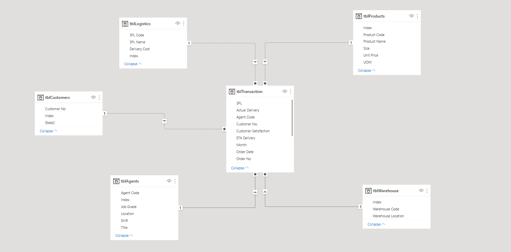
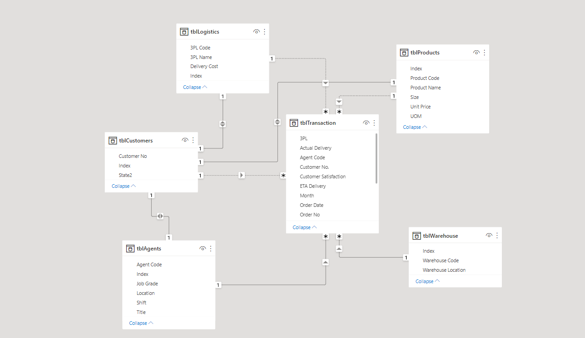
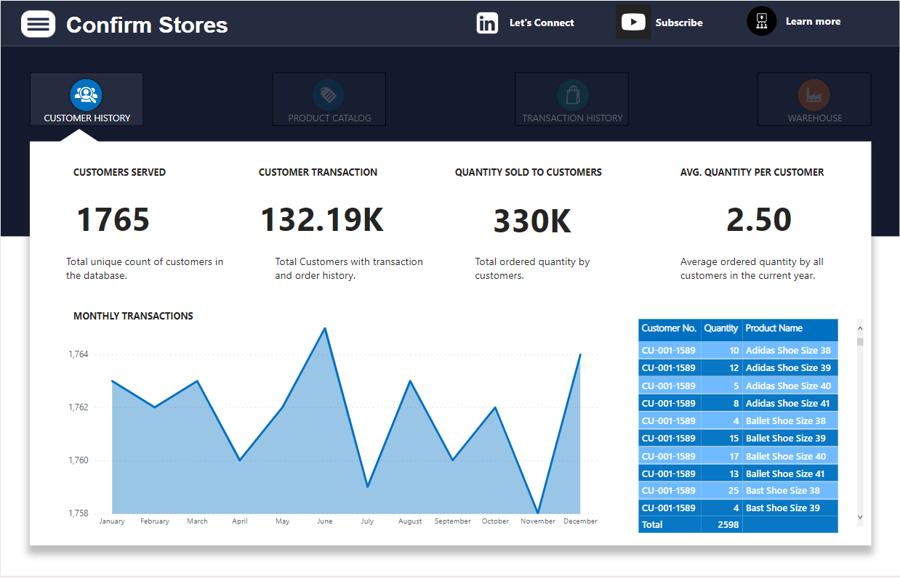
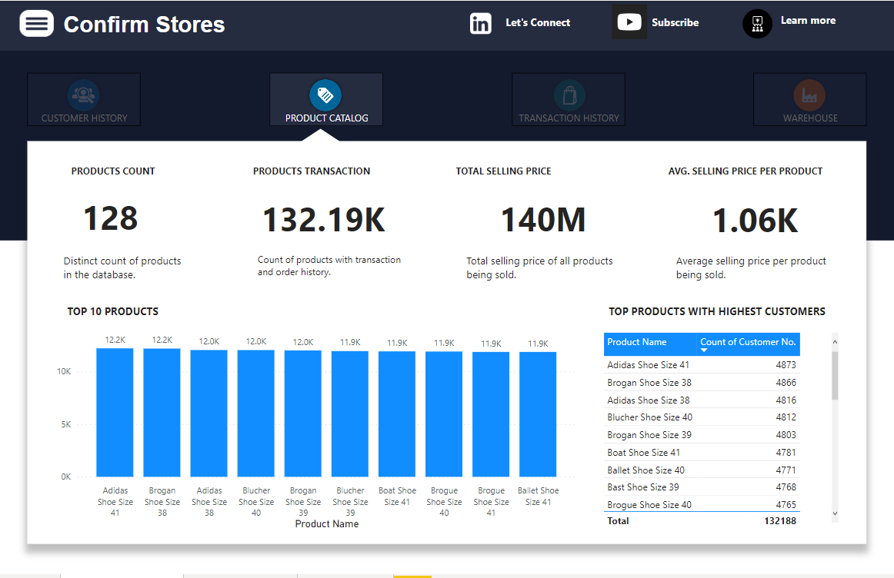
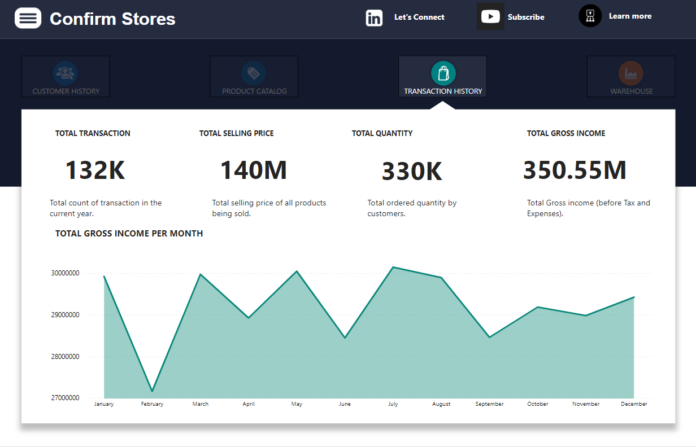
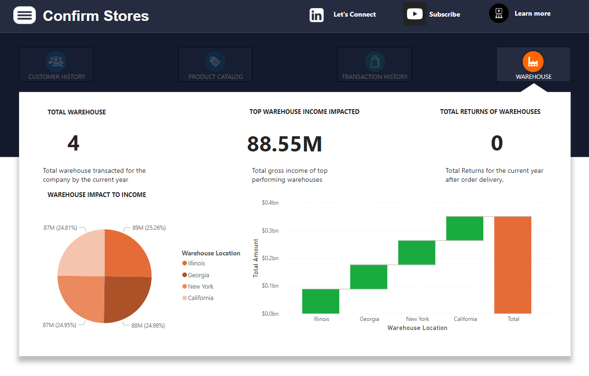

# Confirm Stores Analysis

---

## Introduction

This is a power Bi project on sales analysis of an imaginary store called **Confirm Stores**. 
The project is to analyze and derive insights to answer crucial questions and help the store make data driven decisions.

**_Disclaimer_** : _All datasets and reports do not represent any company, institution or country,  but just a dummy dataset to demonstrate capabilities of Power BI._

**_Objective: This is a short demo to teach data analyst on how they can leverage Github to documenting their project. I showcased this while giving a tutorial on "Documenting Data Analyst Project on GitHub" via the Microsoft Reactor YouTube channel._**

## Problem statement
1.	Which warehouse has the highest impact on income in the current year?
2.	What is the worth in dollars of the total products available?
3.	What is the average cost per product?

## Skills/ concepts demonstrated:

The following Power BI features were incorporated:
- Bookmarking, 
- DAX, 
- Quick measures, 
- Page navigation, 
- Modelling, 
- Filters, 
- tooltips, 
- Button

## Modelling:
Automatically derived relationships are adjusted to remove and replace unwanted relationships with the required.

Adjusted model                  |     Auto-model
:------------------------------:|:--------------------:
         |  

The model is a star schema.
There are 5-dimension tables and 1 fact table. The dimension tables are all joined to the fact table with a one-to-many relationship.

## Visualization:

The report comprises 4 pages:
1.	Customer hx
2.	Product catalog
3.	Transaction hx
4.	Warehouse

You can interact with the report [here](https://app.powerbi.com/view?r=eyJrIjoiN2RlZWViMTktMzY0ZC00Y2Q3LWJjMzUtMDY5ZDI0YzUyNjgwIiwidCI6ImEzYmZiMTI3LTJmZjQtNDAxMS1iNjNhLTkyZTg5MjI1MDI2YSJ9) 

Features:
-	Hamburger is button to display the country and month filters while the red coloured “X’ button closes the filter.
-	The four tabs are buttons with hovering effect and each navigates to the page with similar name.

 ## Analysis:
 
### Customer History: 
The store currently have a total of 1765 customers.
330K orders were made in the current year.

### Product catalog: 

There are 128 products in the stores with a worth of 140 million dollars.
Each product cost more than 1k dollars on average. 🤓

### Transaction History: 

Total selling price is 140 million.
The highest gross income was generated in July.
There is an intermittent rise and fall in the gross income of the store by every other month in the current year.

Warehouse:

## Conclusion and Recommendations:

-	Illinois has the highest impact on income although relatively negligible.
-	There are 128 products in the stores with a worth of 140 million dollars. 😄

#Recommendation: 
For a deep dive into the analytics, the datasets of the previous years will be required for comparison and data driven decision making.

